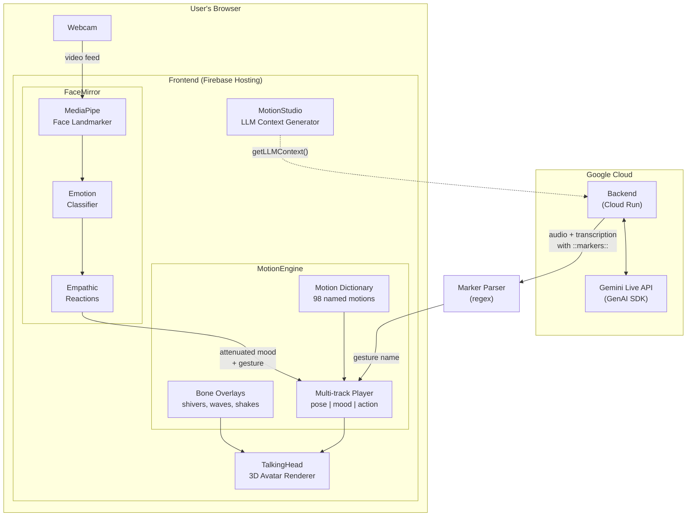

# MotionEngine

> **Semantic motion layer for LLM-driven 3D avatars.**

A plugin for [TalkingHead](https://github.com/met4citizen/TalkingHead) that gives 3D avatars rich body language — without burdening the LLM. Instead of making models reason about morph targets and bone rotations, MotionEngine lets them pick from a curated catalog of **98 named motions**, saving tokens and improving real-time responsiveness.

**[Live Demo](https://lhupyn.github.io/motion-engine/)** · **[Face Mirror](https://lhupyn.github.io/motion-engine/mirror.html)** · **[LLM Playground](https://lhupyn.github.io/motion-engine/playground.html)** · **[Reference Implementation](https://doacam.com)**

---

## Why MotionEngine exists

We started by asking Gemini Live to animate a 3D avatar directly — generating gestures from examples via system prompt while holding a real-time conversation. It failed in three ways: the model got distracted from the conversation, tool calls on the preview model threw errors, and the time to generate each animation was unacceptable for real-time.

That failure shaped our core philosophy: **don't make the LLM do work it doesn't need to do.**

Every function we could delegate to the client meant fewer tokens consumed, lower latency, and a model that could focus on what it does best — talk. This led us to build MotionEngine: a layer that handles all avatar animation logic outside the LLM, so the model only needs to name a gesture and keep talking.

## How it works

MotionEngine creates **two distinct avatar states** that together produce a seamless experience:

### When the avatar speaks — Markers in the stream

Instead of using tool calls (which break conversational flow and add latency), the LLM embeds lightweight `::marker::` tokens directly in its speech. The model is instructed not to read them aloud. On the frontend, markers are detected via regex in the transcription, routed to the appropriate animation track, and stripped from the user-facing output.

The LLM never leaves its conversational context. Animations stay coupled to the exact moment in speech where they belong.

### When the avatar listens — Empathic vision

When the avatar isn't speaking, a local algorithm powered by [MediaPipe Face Landmarker](https://ai.google.dev/edge/mediapipe/solutions/vision/face_landmarker) reads the user's facial expressions through the webcam. Instead of sending this data to the LLM (more tokens, more latency), the algorithm generates empathic avatar responses entirely on the client — a soft smile when the user smiles, a nod, a tilt of the head.

It doesn't clone the user's face. It *reacts* naturally with attenuated intensity and complementary gestures.

| Avatar state | Animation source | LLM involved? |
|---|---|---|
| **Speaking** | `::markers::` in transcriptions | Yes (gesture names only) |
| **Listening** | Empathic vision via MediaPipe | No |

## Architecture



**Three components, one pipeline:**

- **MotionEngine** (runtime) — Multi-track playback system with three parallel tracks: `pose` (persistent body position), `mood` (persistent emotional state), and `action` (temporal gestures). Moods persist while actions play on top and finish. Includes declarative bone overlays for physical effects like shivers and waves.

- **FaceMirror** (vision) — Gives the avatar presence while listening. Uses MediaPipe to read the user's webcam and classify 18 facial expressions into avatar reactions. In empathic mode, the avatar responds with attenuated moods and complementary gestures — it doesn't mirror the user, it *reacts* to them.

- **MotionStudio** (authoring, optional) — Discovery and LLM integration layer. `getLLMContext()` produces a token-efficient motion catalog for system prompts. Can also parse and play dynamic motions from LLM-generated JSON.

**Reference deployment** ([doacam.com](https://doacam.com)):
- Backend on **Google Cloud Run** using **Google GenAI SDK** with **Gemini Live API**
- Frontend on **Firebase Hosting** with TalkingHead + MotionEngine

---

## Quick start

### Install

```bash
npm install github:lhupyn/motion-engine
```

### Basic usage

```js
import { MotionEngine } from 'motion-engine';
import motions from 'motion-engine/motions';

const engine = new MotionEngine(talkingHead);
engine.registerMotions(motions);

// Hook into TalkingHead render loop (required for bone overlays)
talkingHead.opt.update = (dt) => engine.update(dt);

// Set a mood (persists)
await engine.play('thinking');

// Play an action on top (mood stays active)
await engine.play('nod_yes');

// Play a sequence
await engine.playSequence(['wave_right', 'thumbup_right']);
```

### LLM integration

```js
import { MotionStudio } from 'motion-engine/studio';

const studio = new MotionStudio(engine);

// Get compact motion catalog for system prompts
const context = studio.getLLMContext();

// Play a dynamic motion from LLM-generated JSON
await studio.playDynamic('{"dt": [500, 2000, 500], "vs": {"mouthSmile": [0.8]}}');
```

### Face Mirror

When the avatar isn't speaking, it shouldn't just freeze. FaceMirror reads the user's facial expressions through the webcam using [MediaPipe](https://ai.google.dev/edge/mediapipe/solutions/vision/face_landmarker) and translates them into subtle avatar reactions — all on the client, no LLM tokens spent.

It detects **20 expressions** (happy, sad, angry, surprised, yawn, wink, tongue out, and more) and maps each to an avatar response. Pause it while the avatar speaks, resume when it listens:

```js
// Start when the avatar begins listening
await engine.startMirror(videoEl, { mode: 'empathic' });

// Pause while speaking (so the avatar doesn't react to itself)
engine.pauseMirror();

// Resume when listening again
engine.resumeMirror();
```

#### Mirror vs Empathic

| | `mirror` | `empathic` |
|---|---|---|
| **Behavior** | Copies user's expression 1:1 | Reacts with a complementary gesture |
| **You smile** | Avatar smiles at full intensity | Avatar smiles softly (30%) |
| **You yawn** | Avatar yawns | Avatar nods and gets slightly sleepy |
| **Head tracking** | No | Yes, attenuated (25%) |
| **Transitions** | Instant switch | Smooth lerp every frame |
| **Best for** | Debugging, demos | Production, conversations |

In empathic mode, each detected expression has a `_react` rule in the motion data that defines *how* the avatar responds — which mood to enter, at what intensity, and what gesture to play. The result feels like someone who's listening and present, not a mirror.

> **Peer dependency:** `@mediapipe/tasks-vision >= 0.10.0` (optional — only needed when using FaceMirror). Standalone usage without MotionEngine is also supported — see [API docs](docs/API.md).

---

## Motion format

Motions are defined as JSON data. Each motion combines face morphs, hand gestures, body poses, and bone overlays in a single object:

```json
{
  "my_motion": {
    "_description": "Human-readable description for LLM discovery",
    "_tags": ["emotion", "category"],
    "_track": "action",
    "dt": [300, 2000, 500],
    "rescale": [0, 1, 0],
    "vs": {
      "mouthSmile": [0.6],
      "gesture": [["handup", null, true], null]
    },
    "_overlay": {
      "bones": {
        "RightHand": { "freq": 8, "amp": [0, 0.12, 0.12], "phase": 0 }
      },
      "delay": 400,
      "duration": 2500
    }
  }
}
```

The `_track` field controls routing:
- `"mood"` — persistent emotional state, injected into TH's native mood system
- `"action"` — temporal gesture, uses TalkingHead gesture playback (default)

Any motion can include `_detect` (blendshape classifier for face mirroring) and `_react` (empathic response definition) schemas. See [API docs](docs/API.md) for details.

---

## What's next

- **On-demand vision** — Stop sending webcam frames while the avatar speaks. Let the LLM request images only when it needs them. Empathic vision handles the rest locally.
- **On-device micro-LLM** — Delegate animation decisions to a small local model like Gemma, pushing the philosophy further: the main LLM only talks, everything else runs on the device.
- **Beyond avatars** — The same semantic motion layer could drive physical robots. Empathic reactions, gesture vocabularies, and marker-based animation apply to servos and actuators just as they do to 3D meshes.

---

## Development

```bash
git clone https://github.com/lhupyn/motion-engine.git
cd motion-engine
npm install
npm run demo        # dev server with hot reload
npm test            # run tests
npm run test:watch  # watch mode
```

---

## API Reference

Full API documentation for MotionEngine, MotionStudio, and FaceMirror is available in [docs/API.md](docs/API.md).

---

## Credits

- **[TalkingHead](https://github.com/met4citizen/TalkingHead)** by Mika Suominen — MIT License.
- **[MediaPipe Face Landmarker](https://ai.google.dev/edge/mediapipe/solutions/vision/face_landmarker)** by Google — real-time blendshape detection in FaceMirror.
- **Demo avatar**: Created with [Ready Player Me](https://readyplayer.me/).

## License

MIT
